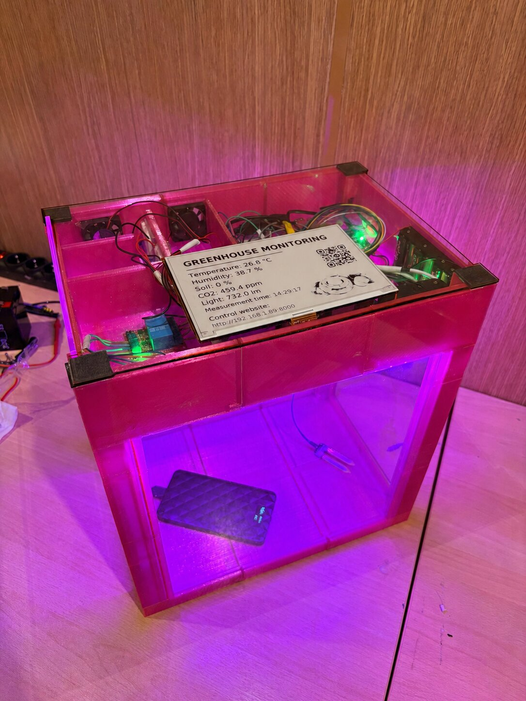
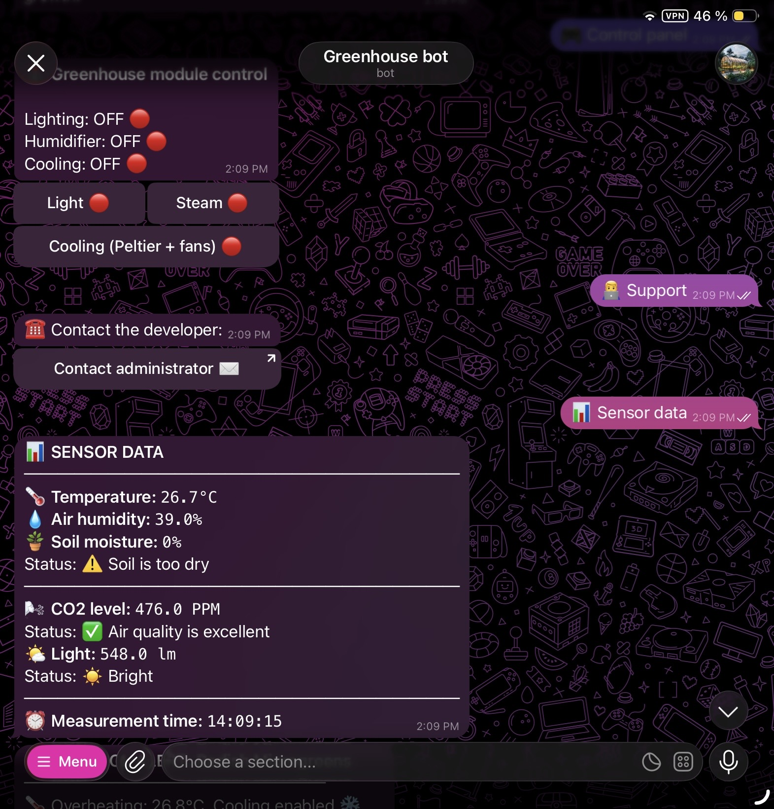
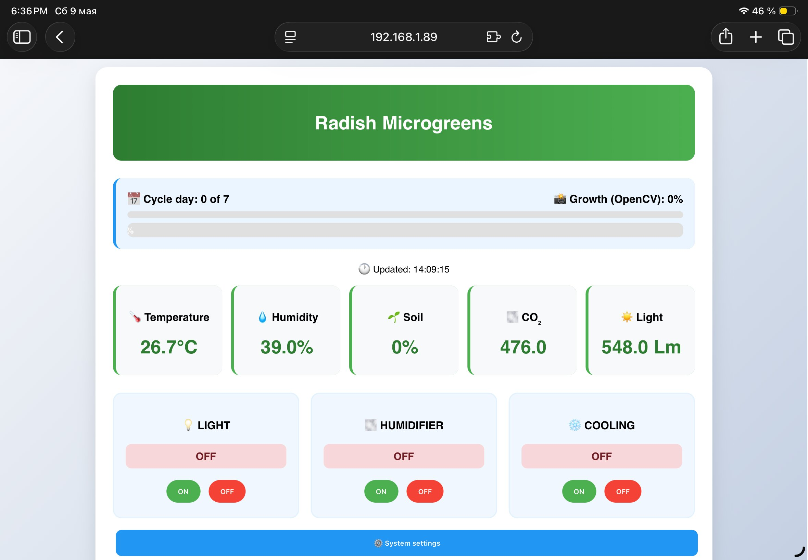
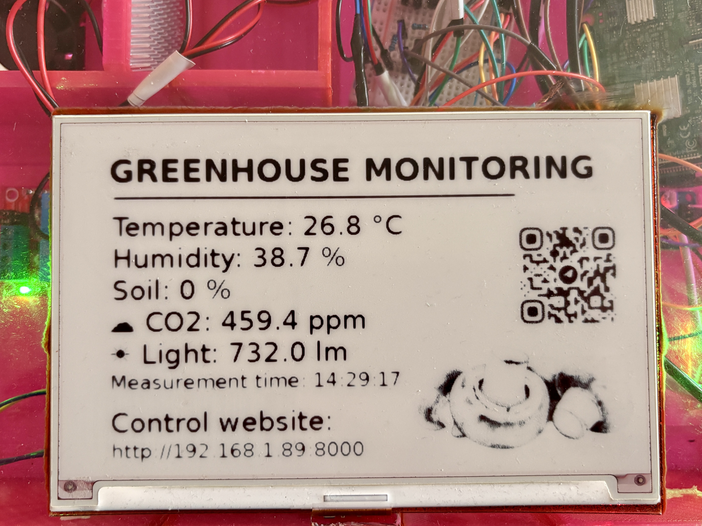

# 🪴 Smart GreenHouse System


Smart GreenHouse System is an IoT-based platform developed using Raspberry Pi 3B+.
It monitors environment conditions and automatically controls the system to help plants grow in optimal conditions.

The project combines 3D modeling, environmental sensors, a web dashboard, a Telegram Bot, a local E-paper display and computer vision into a single automated ecosystem.   

---

## 🎯 Why I built this project


Today, many people want to eat **fresh** and **healthy** food, but it isn't always easy to find this food in local supermarkets. 
Growing plants at home is really difficult for many people, because you need to constantly monitor environmental conditions: temperature, humidity and soil moisture. 

I decided to build this project to help people grow fresh herbs, mint, and other plants at home more conveniently and with minimal effort by automating routine greenhouse tasks.

---

## 🔎 Preview

### Final System



### Telegram Bot interface




### Website interface




### E-paper Display



---

## 🌟 Features

- 🌡️ Temperature and humidity monitoring
- 💧 Soil moisture monitoring
- ☀️ Light intensity monitoring
- 🌬️ CO2 concentration monitoring
- 🧊 Automatic cooling and humidification control
- 📱 Telegram Bot for control parameters and notifications
- 🌐 Web dashboard 
- 🖥️ E-paper local display
- 🤖🧠 Computer vision module (OpenCV) for plant growth analysis
- 🖨️ Custom 3D-printed enclosure
- 📊 Real-time sensor data

---

## ⚙️ Technologies

### 🖨️ 3D Design & Printing

- KOMPAS-3D (CAD)
- UltiMaker Cura
- 3D printer Dobot Mooz 3DF Plus

### ⚒️ Hardware

- Raspberry Pi 3 Model B+
- Temperature and Humidity sensor (DHT22)
- Soil Moisture sensor (YL-38)
- Light sensor (KY-018)
- Air Quality sensor (MQ-135)
- Steam generator
- Relay module
- Peltier Cooling module 
- LED Grow light
- E-paper display (Waveshare 7.5")

### 💻 Software

- Raspberry Pi GPIO
- Python
- FastAPI
- Aiogram
- HTML/CSS
- OpenCV
- JSON 

---

## 🏗 System Architecture

```text
Sensors → Raspberry Pi → JSON Database
                                ↓
              Telegram Bot / Website / E-paper display
```

All interfaces synchronize environmental data in real time through the JSON-based data exchange system.

---

## 📂 Repository Structure

``` text
smart-greenhouse-system/
⏐
⏐⎯ main.py
⏐⎯ tg_bot.py
⏐⎯ e-paper.py
⏐⎯ vision_engine.py
⏐⎯ dht22_sensor.py
⏐⎯ air_sensor.py
⏐⎯ lux_sensor.py
⏐⎯ moisture_sensor.py
⏐
⏐
⏐⎯ templates/
⏐   ⏐⎯ index.html
⏐   ⏐⎯ login.html
⏐   ⏐⎯ settings.html
⏐    
⏐
⏐⎯ config.json
⏐⎯ display_template.jpg
⏐⎯ requirements.txt
⏐⎯ .env.example
⏐⎯ .gitignore
⏐⎯ README.md
```
---


## 🚀 How system works

1.  Sensors collect environmental data
2.  Raspberry Pi processes the information
3.  Computer Vision (OpenCV) analyzes crop growth and greenhouse conditions from camera images
4.  Data is displayed on the website and E-paper display
5.  The Telegram Bot sends real-time alerts, status updates, and current environmental conditions and allows you to control devices
6.  Actuators automatically control cooling, lighting and humidity


---


## 📥 Installation

- Clone the repository.

- Install dependencies:

```bash
pip install -r requirements.txt
```

- Create a `.env` file using `.env.example` and configure:

```env
BOT_TOKEN=your_telegram_bot_token
ADMIN_ID=your_telegram_user_id
PROXY=your_vpn_proxy
ADMIN_PASSWORD=your_password_for_website
```

- Configure Wi-Fi credentials.

- Run the system:

```bash
python tg_bot.py
python main.py
python e-paper.py
```
---

## 📚 Additional Materials and Documentation

Additional project materials are available in Google Drive:

- Project documentation
- 3D models
- Drawings & Specifications
- Wiring diagram
- Demonstration videos
- Photos of the system

This folder includes some demonstration videos:

- Real-time working of the system
- Telegram Bot demonstration
- Website demonstration


[Google Drive Folder](https://drive.google.com/drive/folders/1Vl7cnUSdAOg7_UUUHxxWYO9Hi9CsLcvI?usp=drive_link "Smart GreenHouse System")

---


## 👩🏼‍💻 Author

Created by Vasilisa Korchagina

GitHub: <https://github.com/vee-kr>
